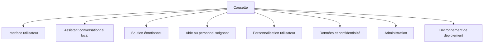

# PBS

Le **PBS** (*Product Breakdown Structure*) décrit les éléments qui composent le produit final.

---

## Structure

### 1. Interface utilisateur

- Écran de conversation simple
- Interface adaptée aux personnes âgées
- Entrée vocale
- Sortie vocale
- Paramètres d’accessibilité

### 2. Assistant conversationnel local

- Modèle de langage exécuté en local
- Moteur de conversation
- Gestion du contexte de dialogue
- Règles de sécurité et de modération

### 3. Soutien émotionnel

- Dialogue empathique
- Relance de conversation
- Réponses rassurantes
- Détection de signaux faibles d’isolement

### 4. Aide au personnel soignant

- Réduction des sollicitations conversationnelles répétitives
- Aide au repérage de situations nécessitant de l’attention
- Synthèse non médicale des interactions importantes
- Paramétrage des seuils d’alerte

### 5. Personnalisation utilisateur

- Profil de la personne accompagnée
- Préférences de conversation
- Centres d’intérêt
- Mémoire locale des informations autorisées

### 6. Données et confidentialité

- Stockage local des données
- Chiffrement des informations sensibles
- Contrôle des accès
- Absence d’envoi vers un cloud externe

### 7. Administration

- Tableau de bord pour les aidants ou l’établissement
- Gestion des profils
- Configuration des paramètres
- Consultation des alertes ou points d’attention

### 8. Environnement de déploiement

- Installation sur appareil local ou serveur interne
- Fonctionnement hors ligne
- Maintenance
- Mises à jour contrôlées

---

## Description générale des fonctions du PBS

| Élément du PBS | Fonction principale |
| --- | --- |
| Interface utilisateur | Permettre une utilisation simple, lisible et accessible par les personnes âgées. |
| Assistant conversationnel local | Générer des réponses naturelles sans transmettre les échanges à un service externe. |
| Soutien émotionnel | Offrir une présence d’écoute, de réassurance et de dialogue au quotidien. |
| Aide au personnel soignant | Soutenir les équipes en accompagnant certains échanges simples et répétitifs. |
| Personnalisation utilisateur | Adapter les conversations aux habitudes, préférences et centres d’intérêt de la personne. |
| Données et confidentialité | Protéger les informations personnelles grâce à un traitement et un stockage locaux. |
| Administration | Permettre aux aidants ou responsables de configurer l’outil et de suivre les points d’attention. |
| Environnement de déploiement | Définir les conditions d’installation, d’utilisation hors ligne et de maintenance. |

---
