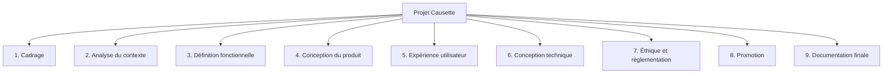

# WBS

Le **WBS** (*Work Breakdown Structure*) décrit le travail nécessaire pour réaliser le projet.

## Structure

### 1. Cadrage du projet

- Définir le besoin principal
- Identifier les utilisateurs cibles
- Définir les limites du projet
- Formuler les objectifs pédagogiques

### 2. Analyse du contexte

- Étudier le problème de l’isolement des personnes âgées
- Identifier les besoins des EHPAD et maisons de retraite
- Analyser les contraintes du personnel soignant
- Identifier les enjeux de confidentialité

### 3. Définition fonctionnelle

- Définir les fonctionnalités principales
- Définir les fonctionnalités secondaires
- Définir les cas d’usage
- Décrire les limites du système

### 4. Conception du produit

- Concevoir le PBS
- Décrire les fonctions du PBS
- Définir l’architecture générale
- Définir les choix de fonctionnement local

### 5. Conception de l’expérience utilisateur

- Définir les principes d’accessibilité
- Concevoir une interface simple
- Prévoir les interactions vocales
- Adapter le ton conversationnel au public âgé

### 6. Conception technique

- Choisir une approche de modèle local
- Définir le stockage local
- Définir les règles de sécurité
- Définir les mécanismes de contrôle d’accès

### 7. Cadre éthique et règlementaire

- Définir les limites médicales du système
- Préciser que l’outil ne remplace pas les soignants
- Identifier les risques liés à la dépendance émotionnelle
- Décrire les principes de protection des données

### 8. Promotion du projet

- Rédiger la description courte du projet
- Créer les schémas commerciaux
- Réaliser une présentation promotionnelle
- Créer une page GitHub Pages dédiée

### 9. Documentation finale

- Rédiger la documentation du projet
- Intégrer le PBS et le WBS
- Relire et harmoniser les documents
- Préparer les livrables attendus

